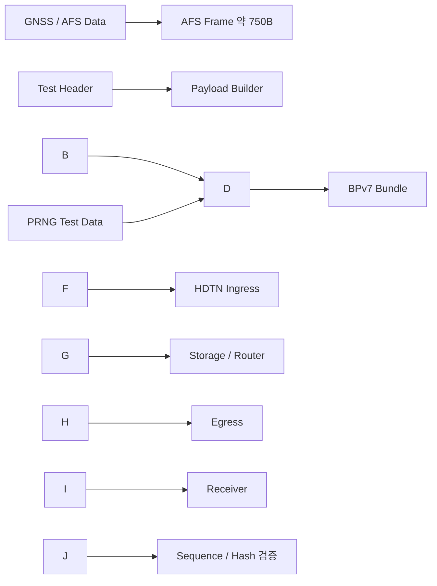
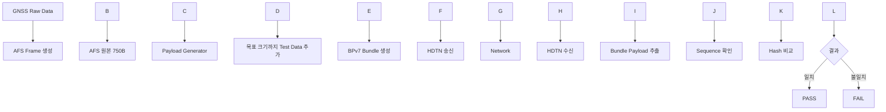

# HDTN 성능검증을 위한 대용량 Payload 구성방안 검토

## 1\. 문서 목적

본 문서는 LNIS 네트워크 검증장치에서 **GNSS/AFS 데이터량이 작을 경우 HDTN 성능을 어떻게 검증할 것인지**에 대한 기술검토 의견을 정리한 자료이다.

특히 다음 회의에서 설명해야 할 핵심 쟁점을 중심으로 작성하였다.

* AFS Frame은 약 6000 bit, 즉 약 750 Byte 수준으로 데이터량이 작음
* HDTN의 고속·대용량 전달 성능을 검증하기에는 AFS 원본 데이터만으로 부하가 부족할 수 있음
* 단순히 AFS 1 bit 데이터를 8 bit 또는 16 bit 표현으로 확장하는 방법이 적절한지 검토
* HDTN 오픈소스의 `bpgen`, `bpsink`, 파일/스트림 전송 시험 구조를 고려한 시험 Payload 생성방안 제안
* Bundle 크기, Bundle Rate, 총 전송량, CLA Rate 등을 독립 시험변수로 설정하는 방안 제안

\---

# 2\. 결론 요약

권장 방향은 다음과 같다.

> \*\*AFS Frame 자체는 규격에 맞게 750 Byte 형태로 유지하고, HDTN 성능시험용으로 별도의 검증용 Payload를 추가하여 Bundle 크기를 가변 생성하는 방식이 가장 적절하다.\*\*

```text
AFS 원본 750 Byte
      +
시험 Header
      +
검증용 Generated Payload
      ↓
목표 Bundle Payload 크기 생성
      ↓
HDTN / BPv7 전송
```

\---

# 3\. AFS 데이터 크기와 문제점

AFS Frame이 6000 bit라고 할 경우 원본 데이터 크기는 다음과 같다.

|구분|계산|데이터 크기|
|-|-:|-:|
|AFS Frame|6000 bit|750 Byte|
|AFS Frame 10개|60000 bit|약 7.5 KB|
|AFS Frame 100개|600000 bit|약 75 KB|
|AFS Frame 1000개|6000000 bit|약 750 KB|

AFS 데이터 자체만 HDTN에 적재하면 Bundle 하나의 Payload가 매우 작을 수 있다.

HDTN은 단순히 "Bundle 하나가 정상 전송되는가"만 확인하는 시스템이 아니라, 다음과 같은 성능 특성을 확인할 필요가 있다.

* 초당 처리 가능한 Bundle 수
* 초당 처리 가능한 Payload Byte 수
* 큰 Bundle 처리 시 Throughput
* 작은 Bundle 다량 처리 시 Bundle Processing Overhead
* Storage 사용량
* Egress Pipeline 처리량
* 링크 단절 및 복구 시 Store-and-Forward 동작
* CLA별 전송성능

따라서 **AFS 750 Byte만 반복 전송하는 시험과 대용량 Payload를 구성한 시험을 분리할 필요가 있다.**

\---

# 4\. HDTN 오픈소스 구조에서 확인되는 시험 방향

NASA HDTN 오픈소스에는 Bundle 생성 및 수신 시험을 위한 도구가 포함되어 있다.

주요 예시는 다음과 같다.

|구분|HDTN 구성요소|용도|
|-|-|-|
|Bundle 생성|`bpgen` / `bpgen-async`|시험 Bundle 생성|
|Bundle 수신|`bpsink`|Bundle 수신 및 성능시험|
|파일 전송|`bpsendfile`, `bpreceivefile`|파일 기반 Payload 시험|
|Packet 전송|`bpsendpacket`, `bpreceivepacket`|Packet 기반 시험|
|Stream 전송|`BpSendStream`, `BpReceiveStream`|Streaming 시험|
|대용량 시험|`runscript\_bpgen\_bpv7\_10GB.sh`|대규모 BPv7 전송시험|
|CLA별 시험|TCP / UDP / STCP / LTP 관련 test script|전송방식별 비교|

즉 HDTN 오픈소스 자체가 **Payload 종류와 Bundle 생성률을 바꾸어 성능시험을 수행하는 구조**를 제공하고 있다.

특히 저장소에는 다음과 같은 시험 스크립트가 존재한다.

```text
tests/test\_scripts\_linux/
 ├─ runscript\_bpgen\_bpv7\_TCP.sh
 ├─ runscript\_bpgen\_bpv7\_UDP.sh
 ├─ runscript\_bpgen\_bpv7\_LTP.sh
 ├─ runscript\_bpgen\_bpv7\_STCP.sh
 └─ runscript\_bpgen\_bpv7\_10GB.sh
```

또한 Streaming 관련 시험에는 H.264/H.265 비디오 데이터 전송 시나리오도 포함되어 있다.

따라서 HDTN 시험에서는 특정 GNSS/AFS 데이터만 고집할 필요가 없으며,

> \*\*실제 응용 데이터 + 생성된 시험 Payload\*\*

형태로 충분한 Traffic을 만들어 성능을 측정하는 방식이 HDTN의 시험 구조와 잘 맞는다.

\---

# 5\. 권장 Payload 구성방안

## 5.1 기본 구조

```text
┌───────────────────────────────┐
│       HDTN Bundle Payload     │
├───────────────────────────────┤
│ Test Header                   │
│ - Test ID                     │
│ - Sequence Number             │
│ - Timestamp                   │
│ - Original Data Size          │
│ - Total Payload Size          │
│ - Pattern / Seed              │
├───────────────────────────────┤
│ GNSS / AFS Original Data      │
│ - AFS Frame 약 750 Byte       │
├───────────────────────────────┤
│ Generated Verification Data   │
│ - 목표 Payload 크기까지 생성  │
├───────────────────────────────┤
│ Integrity Information         │
│ - CRC 또는 SHA-256            │
└───────────────────────────────┘
```

이 구조의 장점은:

1. AFS 원본 포맷을 그대로 유지할 수 있음
2. 원하는 크기의 Bundle Payload를 정확히 만들 수 있음
3. Sequence Number를 통해 누락/중복/순서변경 확인 가능
4. Hash를 이용해 End-to-End 데이터 일치 여부 확인 가능
5. AFS 데이터와 성능시험용 데이터의 역할을 명확히 구분 가능

\---

# 7\. 검증용 Payload 생성 방식

## 7.1 방법 A. AFS Frame 반복

가장 단순한 방법이다.

```text
AFS Frame #1
AFS Frame #2
AFS Frame #3
...
AFS Frame #N
```

예:

|반복 수|데이터량|
|-:|-:|
|1|약 750 B|
|10|약 7.5 KB|
|100|약 75 KB|
|1000|약 750 KB|
|10000|약 7.5 MB|

장점:

* 구현이 매우 쉬움
* 실제 AFS 데이터가 Payload 대부분을 차지함

단점:

* 동일 데이터 반복 시 무결성 검증 정보가 부족할 수 있음
* Payload 크기를 정확히 1 MB, 10 MB 등에 맞추기 불편할 수 있음

따라서 반복할 경우 아래처럼 Sequence를 추가하는 것을 권장한다.

```text
\[000001]\[AFS Frame 750B]
\[000002]\[AFS Frame 750B]
\[000003]\[AFS Frame 750B]
...
```

\---

## 7.2 방법 B. 고정 Pattern Data 추가

예:

```text
00 01 02 03 ... FD FE FF
00 01 02 03 ... FD FE FF
...
```

장점:

* 생성이 쉬움
* 수신 후 비교가 쉬움
* 원하는 크기만큼 정확하게 생성 가능

단점:

* 패턴이 지나치게 단순하여 실제 랜덤 데이터와 다른 압축/버퍼 특성을 보일 수 있음

\---

## 7.3 방법 C. PRNG 기반 Pseudo Random Data 생성

추천 방식이다.

예:

```text
Seed = 12345
↓
Pseudo Random Payload 생성
↓
TX Hash 계산
↓
HDTN 전송
↓
RX Hash 계산
↓
TX/RX Hash 비교
```

장점:

* 데이터 분포가 실제 Binary Payload와 유사
* 원하는 크기로 생성 가능
* 동일 Seed로 재현 가능
* 무결성 검증이 쉬움

\---

# 8\. 가장 권장하는 구성

다음과 같이 **AFS 원본 + PRNG Test Payload** 구조를 권장한다.



\---

# 9\. Bundle Size와 Bundle Rate를 분리해서 시험해야 하는 이유

HDTN 성능은 단순히 총 데이터량만으로 판단하기 어렵다.

예를 들어 총 1 GB를 전송한다고 해도 다음 두 경우는 처리 특성이 다르다.

## Case A. 작은 Bundle 다량 전송

```text
10 KB × 약 100,000 Bundles ≈ 1 GB
```

특징:

* Bundle Header 생성/파싱 횟수 증가
* Routing 및 Queue 처리 횟수 증가
* Bundle/sec 성능이 중요

## Case B. 큰 Bundle 소량 전송

```text
1 MB × 약 1000 Bundles ≈ 1 GB
```

특징:

* Bundle 처리 횟수 감소
* Bundle 하나당 Payload 처리량 증가
* Byte/sec Throughput이 중요

따라서 다음 두 지표를 모두 측정해야 한다.

```text
Bundle Processing Performance
→ bundles/sec

Data Transfer Performance
→ Mbps / Gbps
```

\---

# 10\. 권장 시험 Matrix

## 10.1 Bundle Payload Size

|단계|Payload Size|목적|
|-|-:|-|
|1|750 B|실제 AFS 원본 수준|
|2|10 KB|소형 Bundle|
|3|100 KB|중형 Bundle|
|4|500 KB|대형 Bundle|
|5|1 MB|대용량 Bundle|
|6|10 MB|고부하 Bundle|

※ 실제 시험 범위는 HDTN 설정 및 환경에 따라 조정 필요

## 10.2 Bundle Rate

|단계|Bundle Rate|
|-|-:|
|1|1 bundle/s|
|2|10 bundle/s|
|3|100 bundle/s|
|4|1000 bundle/s|
|5|최대 처리속도|

## 10.3 총 전송량

|단계|총 데이터량|
|-|-:|
|단기 기능시험|10 MB|
|기본 성능시험|100 MB|
|지속 부하시험|1 GB|
|장시간/고부하시험|10 GB 이상|

HDTN 저장소에는 실제로 `runscript\_bpgen\_bpv7\_10GB.sh` 형태의 대용량 시험 스크립트가 존재하므로, GB 단위 부하시험 자체는 HDTN 시험 방향과 부합한다.

\---

# 11\. 측정해야 할 성능지표

## 11.1 필수

|지표|설명|
|-|-|
|Throughput|초당 전체 전송 Byte|
|Goodput|정상 수신된 실제 Payload 기준 속도|
|Bundles/sec|초당 처리한 Bundle 수|
|Total Transfer Time|전체 데이터 전송 완료시간|
|Bundle Loss|송신 대비 수신 누락 Bundle 수|
|Duplicate Bundle|중복 수신 Bundle 수|
|Integrity|TX/RX Hash 일치 여부|

## 11.2 시스템 자원

|지표|설명|
|-|-|
|CPU Usage|HDTN 프로세스 CPU 사용률|
|Memory Usage|RAM 사용량|
|Storage Usage|Store-and-Forward 사용량|
|Queue Depth|대기 Bundle 개수|
|Egress Backlog|송신 대기 데이터량|

\---

# 12\. DTN과 HDTN 비교 시 추천 조건

비교시험에서는 가능한 한 동일 조건을 유지해야 한다.

```text
동일 Payload Size
동일 Bundle 개수
동일 총 데이터량
동일 네트워크 링크
동일 BP Version
동일 CLA 조건
```

예:

```text
Payload       : 1 MB
Bundle Count  : 1000
Total Data    : 약 1 GB
BP Version    : BPv7
Network       : 1 Gbps Ethernet
```

동일 조건에서:

```text
DTN 구현체
vs
HDTN
```

을 비교하면 다음 차이를 정량화할 수 있다.

* Throughput
* Bundle/sec
* CPU 사용률
* Memory 사용량
* Storage 처리량
* 링크 단절 후 복구 처리시간

\---

# 13\. LNIS 검증장치 적용 제안

## 13.1 Payload Generator 기능 추가

WPF 검증장치에 다음 설정을 제공하는 방안을 권장한다.

```text
\[HDTN Test Payload Generator]

Payload Size
○ 750 B
○ 10 KB
○ 100 KB
○ 500 KB
○ 1 MB
○ Custom

Payload Type
○ AFS Only
○ AFS Repeat
○ Fixed Pattern
○ PRNG

Bundle Rate
○ 1
○ 10
○ 100
○ 1000
○ Max

Total Test Data
○ 10 MB
○ 100 MB
○ 1 GB
○ Custom
```

\---

# 14\. 전체 시험 흐름



\---

# 15\. 권장 시험 단계

## 1단계. 기능 확인

```text
AFS 750 B
↓
BPv7
↓
HDTN
↓
수신
↓
원본 비교
```

목적:

* AFS 데이터를 Bundle에 적재할 수 있는지 확인
* End-to-End 정상 전송 확인

\---

## 2단계. Payload Size 증가시험

```text
750 B
↓
10 KB
↓
100 KB
↓
500 KB
↓
1 MB
```

목적:

* Bundle 크기 증가에 따른 성능 확인

\---

## 3단계. Bundle Rate 증가시험

```text
1 bundle/s
↓
10 bundle/s
↓
100 bundle/s
↓
1000 bundle/s
↓
Maximum
```

목적:

* Bundle 처리량 한계 확인

\---

## 4단계. 총 데이터량 고정시험

예:

```text
총 데이터량 = 1 GB
```

조건 변경:

```text
10 KB × 다수 Bundle
100 KB × 다수 Bundle
1 MB × 소수 Bundle
```

목적:

* Bundle Size와 Bundle Count가 성능에 미치는 영향 분리

\---

# 16\. 다음 회의에서 제시할 의견

다음과 같이 제안하는 것이 적절하다.

> \*\*AFS Frame 자체는 규격에 맞는 약 750 Byte 형태로 유지하는 것이 적절합니다. 단순히 1 bit 데이터를 8 bit 또는 16 bit로 확장하여 데이터 크기를 증가시키는 방식은 실제 정보량은 증가하지 않고 AFS 데이터 표현만 비효율적으로 변경하는 방식이므로 HDTN 성능시험용으로는 적합하지 않은 것으로 판단됩니다.\*\*

> \*\*대신 HDTN 오픈소스의 BPGen 및 대용량 전송 시험 구조와 유사하게, AFS 원본 데이터 뒤에 검증 가능한 Pattern 또는 Pseudo Random Payload를 추가하여 Bundle Payload 크기를 10 KB, 100 KB, 1 MB 등으로 가변 생성하고, Bundle Rate를 함께 변경하면서 Throughput 및 Bundle/sec를 측정하는 방식이 적절합니다.\*\*

> \*\*추가적으로 총 전송량을 동일하게 고정한 상태에서 Bundle Size를 변경하여 작은 Bundle 다량 처리와 큰 Bundle 소량 처리의 성능 차이를 비교하는 시험을 수행하는 것이 HDTN의 고속 처리 특성을 정량적으로 검증하는 데 효과적입니다.\*\*

\---

# 17\. 회의용 한 장 요약

```text
기존 제안
────────────────────────────
AFS 750 B가 너무 작다
      ↓
1 bit → 8/16 bit로 확대?
      ↓
크기는 증가하지만
실제 정보량은 동일
      ↓
권장하지 않음


권장 제안
────────────────────────────
AFS 원본 750 B 유지
      +
검증용 Test Payload 생성
      ↓
10 KB / 100 KB / 1 MB ...
      ↓
BPv7 Bundle
      ↓
HDTN 전송
      ↓
Throughput / Bundles/sec
Hash / Loss / CPU 측정
```

\---

# 18\. HDTN 오픈소스 근거

본 검토에서 참고한 NASA HDTN 오픈소스 주요 위치는 다음과 같다.

```text
nasa/HDTN

common/bpcodec/apps/
 ├─ bpgen/
 ├─ bpsink/
 ├─ bpsendfile/
 ├─ bpreceivefile/
 ├─ bpsendpacket/
 ├─ bpreceivepacket/
 ├─ BpSendStream/
 └─ BpReceiveStream/

tests/test\_scripts\_linux/
 ├─ runscript\_bpgen\_bpv7\_TCP.sh
 ├─ runscript\_bpgen\_bpv7\_UDP.sh
 ├─ runscript\_bpgen\_bpv7\_LTP.sh
 ├─ runscript\_bpgen\_bpv7\_STCP.sh
 └─ runscript\_bpgen\_bpv7\_10GB.sh

tests/test\_scripts\_linux/Streaming/
 └─ H.264 / H.265 Streaming 시험 스크립트
```

위 구조를 보면 HDTN은 단순 고정 크기 Payload 하나를 전달하는 시험보다,
**Bundle 생성률, 전송방식, Payload 종류 및 대용량 데이터를 조합하여 시험하는 방향**을 이미 지원하고 있음을 확인할 수 있다.

\---

# 19\. 최종 제안

LNIS 네트워크 검증장치의 HDTN 성능시험은 다음 원칙으로 구성하는 것을 권장한다.

1. **AFS 원본 750 Byte는 변경하지 않는다.**
2. **HDTN 성능시험용 Payload는 별도 Generator로 생성한다.**
3. **Bundle Size와 Bundle Rate를 독립 시험변수로 설정한다.**
4. **총 전송량을 고정한 비교시험을 추가한다.**
5. **Sequence + Hash 기반 End-to-End 무결성 검증을 수행한다.**
6. **Throughput과 Bundles/sec를 반드시 함께 측정한다.**
7. **향후 DTN/HDTN 비교시험에서도 동일한 Payload 조건을 사용한다.**

이 방식이 AFS 규격을 유지하면서도 HDTN의 고속·대용량 처리 성능을 정량적으로 검증하기에 가장 적절하다.

